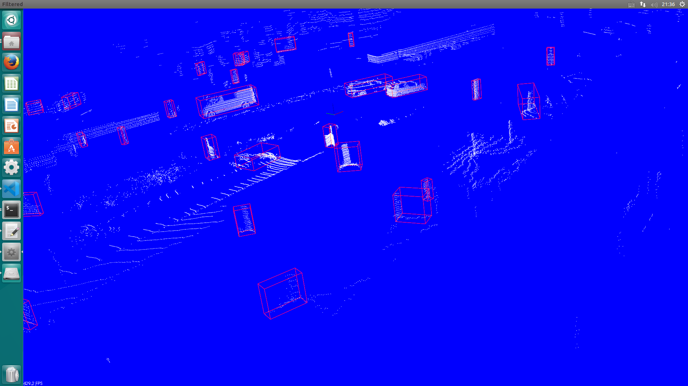

# L-Shape Fitting for lidar point cloud by c++ and PCL

This repository is the c++ implementation of [**Efficient L-Shape Fitting for Vehicle Detection Using Laser Scanners**](https://www.ri.cmu.edu/publications/efficient-l-shape-fitting-for-vehicle-detection-using-laser-scanners/)

Also, this implementation is mainly reference [**AtsushiSakai PythonRobotics**](https://github.com/AtsushiSakai/PythonRobotics/tree/master/Mapping/rectangle_fitting/)
